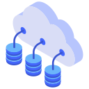
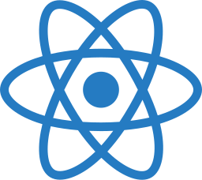
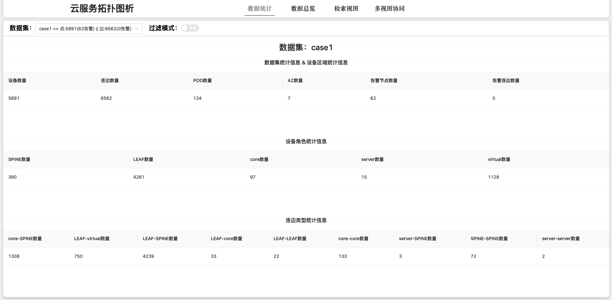
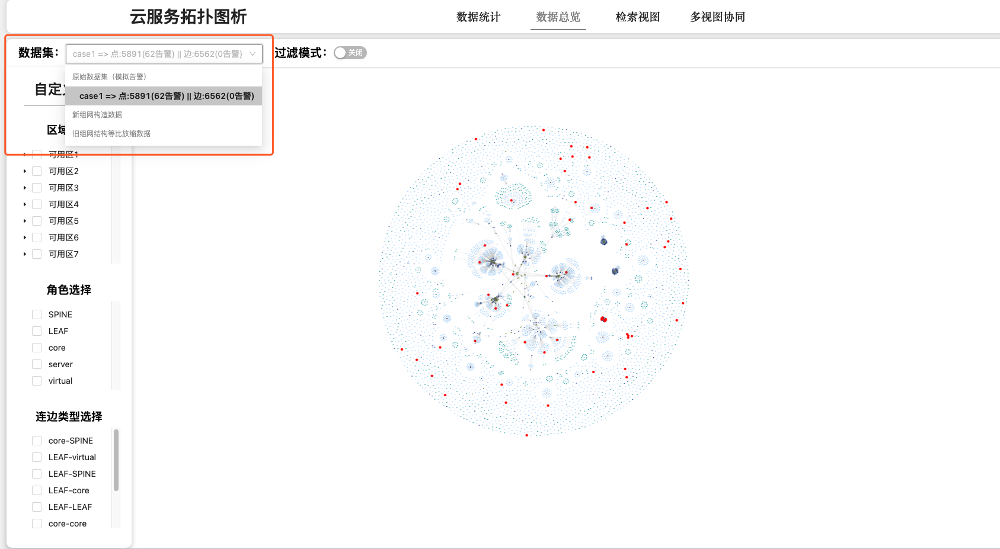
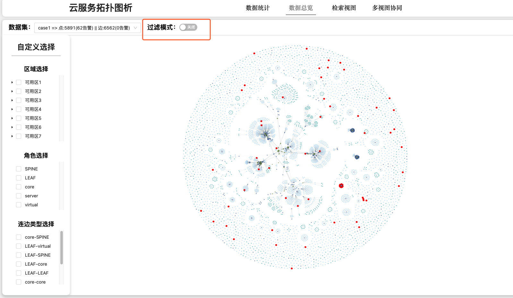
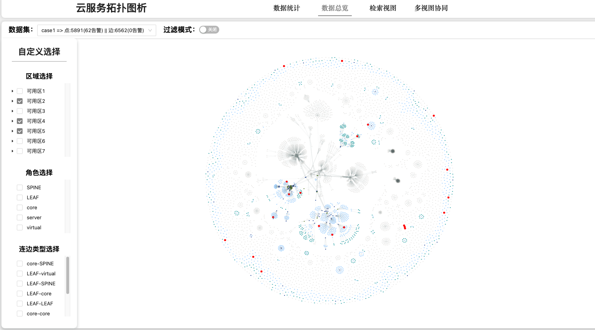

# Multi-View Visualization Method for Cloud network

<p align="center">
  
  
</p>
:warning:  **Note: The data is removed due to privacy. See `Add new datasets` for data configuration.**

## background

**Large-scale cloud service network** operation and maintenance systems are often unfriendly to users due to the large number of devices.

## introduction

An **efficient** and **fast** way to look up cloud network topology.

## install

```bash
npm install
```

- There are two packages `craco` `react-script`**in conflict**, if an error occurs, execute the following instructions

```bash
npm install --force
```

- follow the below steps

```
1. run npm start
2. visit `localhost:3000`
```

## Basic Usage

There are four pages in this project

- **Statistics Page**

  Show detail information about this dataset

  

- **Overview Page**

  - change data source

    

  - change view mode

    

  - Highlight some aera

    - In filter mode (open “过滤模式”)

    

    - In highlight mode (close “过滤模式”)

    

- **Detail View Page**

  In this view, you can l**ook up two specific nodes** and deeply learn **their background (node context)**.

  For the convenience of observation, this page provides the methods of **"find one-hop neighbor"**, **"find two-hop neighbor"** and **"highlight node"**

  

- **Multi-View Page**

  This page consists of three parts, **hierarchical thumbnails**, **main canvas** and **operation sidebar**.

  - The thumbnail uses the force algorithm to **display the connection status of Region-AZ-POD respectively**.
  - The main canvas can **display the connection status of devices** in a specific area. 
  - The operation sidebar can perform some **special operations**. see Advanced Usage.

  

## Advanced Usage

### Totology simplify

If you want to observe a **more efficient topology**, you can introduce some **Community Detection** and **Aggregation** algorithms. Due to some **commercial reasons**, here I can only show the `gif` and cannot provide the code.😢


### Add new datasets

**Added datasets should follow the following format:**

```typescript
interface Node {
    "az": string,
    "pod_name": string,
    "type": string,
    "role": "SPINE"|"CORE"|"LEAF"|"TOR",
    "mgmt_ip": string,
    "is_alarming": boolean
}
interface Link{
    "src_ip": string,
    "dst_ip": string,
}

interface Data {
  nodes:Node[],
  links:Link[],
}
```

For example:

```json
{
  nodes:[
    {
      "az": "可用区1",
      "pod_name": "obs",
      "type": "交换机",
      "role": "SPINE",
      "mgmt_ip": "124.180.219.65",
      "is_alarming": false
    },
    ...
  ],
  
  
  links:[
    {
      "src_ip": "124.183.187.47",
      "dst_ip": "124.183.187.52",
    },
    ...
  ]
}
```


##### Store your data source here

> src/assets

Some data sets are stored here, **Data has been desensitized**

##### configuration data set

> src/util

In the `utils` folder,` getData.js` is the configuration of dataset . If you want to add a dataset, please follow the steps below to modify it in this file

- Step1:

Store the dataset in the corresponding directory

- Step2：

modify```/src/utils/getData.js```

```js
//import data source first
//Replace "casexxxx" with the data set you want to import, and replace ${path} with its corresponding path
import casexxxx from "../assets/${path}" 

//Add this dataset to the datasets in the generate function
export default function generate() {

    const datasets = {
        case1,
        case2,
        case3,
        case4,
        case5,
        case6,
        case7,
        case8,
        case9,
        case10,
      	casexxxxxs, //your new data set
    }

    return datasets;
}
```

- Step3：restart 


## Suggestion

- When observing the **data distribution**, it is recommended to use the **highlight mode**

- When observing the **network structure、detail topology of cloud sub-network** in a certain area, **the connection mode of devices,** etc., it is recommended to use the **focus mode**
- :warning: Frequent switching of modes may lead to untimely updates and incorrect canvas drawing. This problem can be solved by overloading the page
